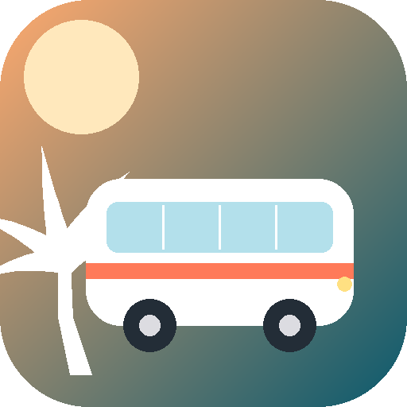

# 🌴🚌 Palm Bus – Home Assistant

Intégration Home Assistant non officielle pour le réseau de transport en commun **Palm Bus** (Cannes Pays de Lérins), basée sur les flux **GTFS** et **GTFS-Realtime** publiés en open data.



## ✨ Fonctionnalités

- Configuration entièrement via l'interface Home Assistant (`config_flow`), sans YAML.
- Suivi d'un ou plusieurs arrêts de bus, avec filtrage par ligne.
- Un capteur **prochain passage** par arrêt (`device_class: timestamp`) avec l'horaire du prochain bus, temps réel si disponible.
- Attributs détaillés sur chaque capteur : ligne, direction, horaire théorique, horaire estimé, retard, couleur de la ligne, et la liste des prochains passages à venir.
- Un capteur **perturbations** par arrêt, avec le nombre de perturbations en cours sur les lignes concernées.
- Rafraîchissement automatique des données en temps réel (toutes les 30 secondes par défaut).
- Données statiques (arrêts, lignes, horaires théoriques) mises en cache et rafraîchies toutes les 24 heures.
- Logo et icônes dédiés, intégrés nativement dans Home Assistant (page Intégrations).

## 📦 Installation

### Via HACS (dépôt personnalisé)

1. Dans HACS, ajoutez ce dépôt comme dépôt personnalisé (type *Intégration*) : `https://github.com/Dujonkev/palmbus`
2. Installez l'intégration **Palm Bus**.
3. Redémarrez Home Assistant.

### Manuelle

1. Copiez le dossier `custom_components/palmbus` dans le dossier `custom_components` de votre configuration Home Assistant.
2. Redémarrez Home Assistant.

## ⚙️ Configuration

1. Allez dans **Paramètres → Appareils et services → Ajouter une intégration**.
2. Recherchez **Palm Bus**.
3. Recherchez et sélectionnez le ou les arrêts à suivre, puis, si besoin, filtrez par ligne.

Chaque arrêt configuré crée deux capteurs :

| Capteur | Description |
|---|---|
| `sensor.<arret>_prochain_passage` | Horaire du prochain bus (timestamp), avec la liste des prochains passages en attribut |
| `sensor.<arret>_perturbations` | Nombre de perturbations en cours sur les lignes de cet arrêt |

### Exemple d'attributs du capteur « prochain passage »

```yaml
nom_arret: Blanchisserie
ligne: "2"
direction: Blanchisserie
horaire_theorique: "2026-09-03T22:05:54+00:00"
horaire_estime: "2026-09-03T22:05:54+00:00"
temps_reel: true
retard_minutes: null
couleur_ligne: "#3fb5e8"
prochains_passages:
  - ligne: "2"
    direction: Blanchisserie
    horaire_estime: "2026-09-03T22:05:54+00:00"
    temps_reel: true
    retard_minutes: null
    couleur_ligne: "#3fb5e8"
  - ligne: "2"
    direction: Les Bastides
    horaire_estime: "2026-09-03T22:20:00+00:00"
    temps_reel: true
    retard_minutes: null
    couleur_ligne: "#3fb5e8"
```

## 🗺️ Source des données

Cette intégration s'appuie sur les jeux de données GTFS et GTFS-RT publiés en open data pour le réseau Palmbus (Cannes Pays de Lérins) :
https://www.data.gouv.fr/datasets/horaires-theoriques-et-temps-reel-gtfs-gtfs-rt-du-reseau-palmbus-cannes-pays-de-lerins/

## ⚠️ Avertissement

Ce projet est une intégration communautaire non officielle et n'est affilié ni à Palm Bus, ni à la Communauté d'Agglomération Cannes Pays de Lérins, ni à Home Assistant / Open Home Foundation.

## 📄 Licence

Distribué sous licence MIT — voir le fichier [LICENSE](LICENSE).
